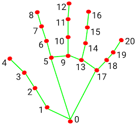

# 🤟 LIBRAS Vision: Reconhecimento e Tradução em Tempo Real


Este projeto utiliza **Visão Computacional** e **Inteligência Artificial** para traduzir o alfabeto da Língua Brasileira de Sinais (LIBRAS) em tempo real. Através da captura de landmarks das mãos, o sistema classifica o sinal, forma frases e oferece uma interface interativa diretamente na câmera.

---

## 📺 Demonstração

<p align="center">
  
  <br>
  <em>Legenda: O sistema reconhecendo sinais e utilizando o botão virtual para limpar a frase.</em>
</p>

---

## ✨ Funcionalidades

* **Extração de Landmarks:** Mapeamento de 21 pontos tridimensionais da mão via Google Mediapipe.
* **Normalização de Coordenadas:** Algoritmo de compensação que subtrai a posição do pulso de todos os outros pontos, permitindo o reconhecimento em qualquer parte do vídeo.
* **Filtro de Estabilidade:** Sistema que exige a manutenção do sinal por 30 frames consecutivos para confirmar a letra, evitando detecções falsas.
* **UI In-Camera (Botão Virtual):** Um botão interativo na tela que pode ser acionado ao "tocar" com o dedo indicador por 1.5 segundos.

---

## 🛠️ Arquitetura Técnica

O projeto ignora a imagem bruta e foca na estrutura óssea da mão. Isso permite que o modelo seja leve e extremamente rápido.

### 📍 Mapeamento de Pontos (Landmarks)
O MediaPipe identifica 21 pontos de articulação. Essa "assinatura geométrica" é o que enviamos para o classificador:

<p align="center">
  
</p>

### 📊 Performance e Resultados
O modelo foi treinado utilizando o algoritmo **Random Forest** com um dataset de ~34.000 imagens.

| Métrica | Valor |
| :--- | :--- |
| **Acurácia nos Testes** | 100.00% |
| **Tempo de Resposta** | Real-time (< 30ms) |
| **Classificador** | Random Forest |

#### 🔍 Por que 100% de Acurácia?
Este resultado deve-se à natureza **vetorial** dos dados. Ao transformar a imagem em coordenadas (x, y) normalizadas, eliminamos ruídos como fundo e iluminação. Como os sinais do alfabeto de LIBRAS possuem geometrias muito distintas, o algoritmo consegue criar fronteiras de decisão perfeitas. A robustez foi validada em testes reais via webcam.

---

## 📂 Estrutura do Repositório

```text
├── data/               # Arquivos CSV gerados (libras_dados.csv)
├── dataset/            # Imagens originais para treino (A-Z)
├── models/             # Modelos serializados (.p)
├── scripts/            # Código fonte do projeto
│   ├── coleta.py       # Extração de dados das imagens
│   ├── treinar.py      # Treinamento do modelo
│   └── main.py         # Aplicação em tempo real
├── requirements.txt    # Dependências do projeto
└── README.md
```

---

## 🚀 Como Executar

### 1. Clonar e Instalar
```bash
git clone [https://github.com/seu-usuario/projeto-libras.git](https://github.com/seu-usuario/projeto-libras.git)
cd projeto-libras
pip install -r requirements.txt
```

### 2. Preparar os Dados
Certifique-se de que o dataset está na pasta `dataset/train` e execute:
```bash
python scripts/coleta.py
```

### 3. Treinar a IA
```bash
python scripts/treinar.py
```

### 4. Iniciar Tradutor
```bash
python scripts/main.py
```

## 🚀 Próximos Passos (Roadmap)

- [ ] Implementar reconhecimento de sinais que envolvem movimento (letras J, K, X, Z).
- [ ] Criar suporte para detecção de ambas as mãos simultaneamente.
- [ ] Exportar o modelo para rodar no navegador via TensorFlow.js.

> *Este projeto foi desenvolvido para fins de estudo em Inteligência Artificial e Acessibilidade.*
```
