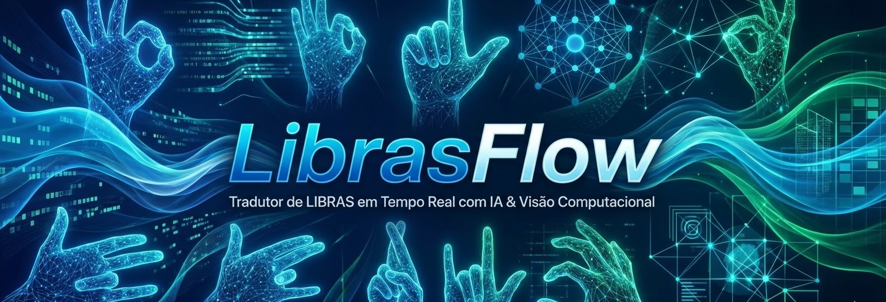

# 🤟 LibrasFlow

<p align="center">
  
</p>

<p align="center">
  
  
  
  
</p>

<p align="center">
  <i>Tradutor inteligente de Língua Brasileira de Sinais (LIBRAS) em tempo real utilizando visão computacional e machine learning.</i>
</p>

---

## 📌 Sobre o Projeto

O **LibrasFlow** é uma aplicação que utiliza **Visão Computacional** e **Machine Learning** para reconhecer sinais do alfabeto em LIBRAS em tempo real via webcam.

A solução captura os movimentos da mão, transforma em dados estruturados e realiza a classificação das letras, permitindo a formação de palavras com feedback visual instantâneo.

> 🎯 Objetivo: Tornar a comunicação mais acessível por meio de tecnologia leve e eficiente.

---

## 🎥 Demonstração

<p align="center">
  
</p>


---

## ✨ Funcionalidades

- 🖐️ Detecção de mãos em tempo real com MediaPipe  
- 📍 Extração de 21 landmarks tridimensionais  
- 🧠 Classificação com Machine Learning (Random Forest)  
- 🔄 Normalização de coordenadas (independente da posição da mão)  
- ⏱️ Filtro de estabilidade para evitar falsos positivos  
- 🖥️ Interface interativa na câmera (botão virtual)  

---

## 🧠 Pipeline do Modelo

O sistema segue um fluxo estruturado de processamento:

1. Captura de imagem (Webcam)  
2. Detecção da mão (MediaPipe)  
3. Extração dos landmarks (x, y, z)  
4. Normalização das coordenadas  
5. Geração de features  
6. Classificação com Random Forest  
7. Pós-processamento (filtro de estabilidade)  
8. Exibição do resultado na interface  

---

## 🛠️ Arquitetura Técnica

O projeto não utiliza diretamente a imagem bruta. Em vez disso, trabalha com a representação geométrica da mão, tornando o sistema:

- Mais rápido  
- Mais preciso  
- Menos sensível a iluminação e ruído  

---

## 📊 Performance

| Métrica | Valor |
|--------|------|
| Modelo | Random Forest |
| Tempo de resposta | < 30ms (tempo real) |
| Dataset | ~34.000 imagens |
| Acurácia (ambiente controlado) | ~100% |

> ⚠️ A acurácia foi obtida em ambiente controlado. Em cenários reais, pode variar devido a iluminação, ângulo e execução dos sinais.

---

## 📂 Estrutura do Projeto

```bash
├── data/               # Dados processados (CSV)
├── dataset/            # Imagens para treinamento
├── models/             # Modelos treinados
├── scripts/
│   ├── coleta.py       # Extração de dados
│   ├── treinar.py      # Treinamento do modelo
│   └── main.py         # Execução em tempo real
├── requirements.txt
└── README.md
```
## 📂 Estrutura do Repositório

```text
├── data/               # Arquivos CSV gerados (libras_dados.csv)
├── dataset/            # Imagens originais para treino (A-Z)
├── models/             # Modelos serializados (.p)
├── scripts/            # Código fonte do projeto
│   ├── coleta.py       # Extração de dados das imagens
│   ├── treinar.py      # Treinamento do modelo
│   └── main.py         # Aplicação em tempo real
├── requirements.txt    # Dependências do projeto
└── README.md
```

---

## 🚀 Como Executar

### 1. Clonar e Instalar
```bash
git clone [https://github.com/seu-usuario/projeto-libras.git](https://github.com/seu-usuario/projeto-libras.git)
cd projeto-libras
pip install -r requirements.txt
```

### 2. Preparar os Dados
Certifique-se de que o dataset está na pasta `dataset/train` e execute:
```bash
python scripts/coleta.py
```

### 3. Treinar a IA
```bash
python scripts/treinar.py
```

### 4. Iniciar Tradutor
```bash
python scripts/main.py
```

## 🚀 Próximos Passos (Roadmap)

- [ ] Implementar reconhecimento de sinais que envolvem movimento (letras J, K, X, Z).
- [ ] Criar suporte para detecção de ambas as mãos simultaneamente.
- [ ] Exportar o modelo para rodar no navegador via TensorFlow.js.

```
